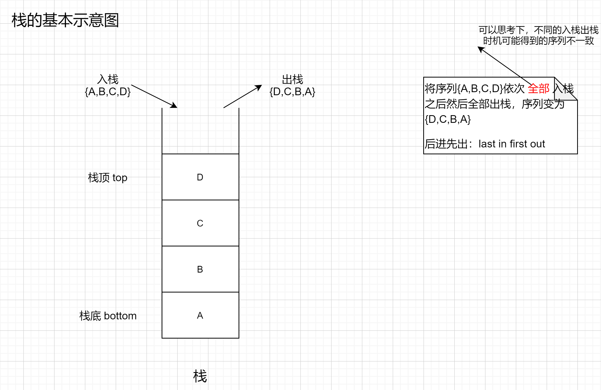
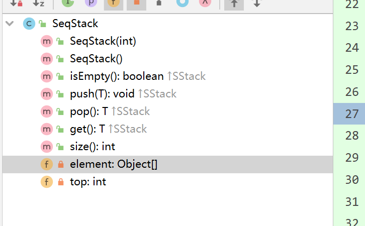
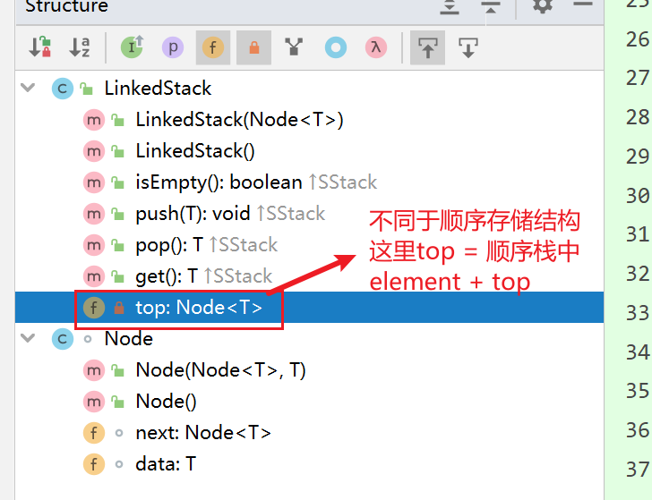
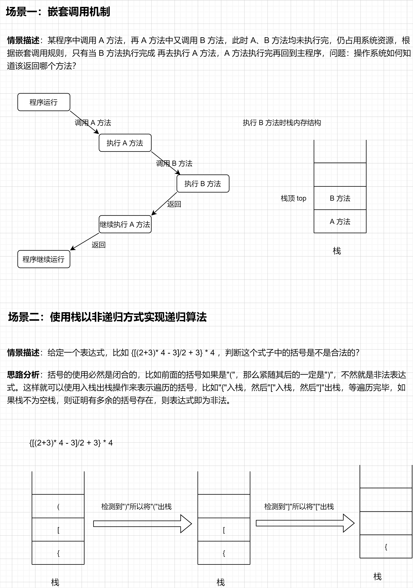

### 0、最初的困惑

> 我最初对栈有了基本的概念认识后，产生了一个很大的困惑，栈只能从一端操作数据，功能又不如数组和链表功能丰富操作性强，直接用数组或者链表去实现不就好了嘛，为什么还要有栈这种结构呢？

​	大概是看了几本相关的书、几节视频课程、用栈结构实现了一些场景的需求之后，我的认知有了明显的变化，可以表述以下几点：

1. 每种数据结构都是对一类高度相似的现实场景的抽象表述。随着对数据结构理解的深入，越来越理解这句话，栈也是这样，再想想浏览器的前进回退功能、检测表达式中总是应该成对存在的括号是否合法等这些场景，不用栈是不是就很麻烦？！
2. 功能多并不一定是最适用的。数组也好链表也罢确实提供了更多的接口，操作性也更强，使用起来更加灵活，但是出错的几率也就更高啊，不像栈这样，就入栈、出栈这点功能，在能实现需求的情况下我们为什么不用使用简单、出错率低的呢？！

### 1、基本概念



1. **栈（stack）**是一种特殊的**线性表**，其插入和删除操作只允许在线性表的一端进行。允许操作的一端成为**栈顶（top）**，不允许操作的一端称为**栈底（bottom）**。
2. 栈中插入元素的操作叫做**入栈（push）**，删除元素的操作叫做**出栈（pop）**。
3. 没有元素的栈成为**空栈**。
4. **后进先出（last in first out）**：由于栈的插入和删除只允许在一端进行，每次入栈元素即成为当前栈顶元素，每次出栈元素总是最后一个入栈的元素，也被叫做后进先出表。

### 2、两种实现方式：顺序栈 + 链表栈

> 存储方式分为两种：开辟一块连续的内存空间顺序存储、链式空间存储

栈基本操作有创建栈、入栈、出栈、取栈顶元素、判断栈是否为空等，其中取栈顶元素仅取元素而不将元素删除。

```java
public interface SStack<T> {

    /**
     * 判断当前栈是否为空栈
     *
     * @return boolean true-是空栈、false-不是空栈
     */
    boolean isEmpty();

    /**
     * 元素入栈
     *
     * @param t 待入栈元素
     * @return void
     */
    void push(T t);

    /**
     * 元素出栈
     *
     * @return T 所出栈的元素
     */
    T pop();

    /**
     * 取出栈顶元素，此时栈顶元素并未出栈
     *
     * @param
     * @return T 栈顶元素
     */
    T get();
}
```


#### 2.1、顺序栈

##### 概念简介：

​	采用顺序存储结构来实现的栈称之为顺序栈。

##### 核心 API 纵览




##### 具体实现：

```java
/**
 * @ClassName SeqStack
 * @Description: 顺序栈类：采用顺序存储结构存储数据来实现栈
 * @Author: myl
 * @Create_time:2021/1/30 16:52
 */
public class SeqStack<T> implements SStack<T> {
    /**
     * 底层使用数据存储元素
     */
    private Object[] element;

    /**
     * 定义栈顶元素的下标，初始化时设置为 -1
     */
    private int top;

    /**
     * 初始化给定容量的栈容器
     * 
     * @param size
     *            指定的栈容器容量大小
     */
    public SeqStack(int size) {
        this.element = new Object[Math.abs(size)];
        this.top = -1;
    }

    /**
     * 默认构造器中容量大小设置为64
     */
    public SeqStack() {
        this(64);
    }

    /**
     * 判断当前栈是否为空栈
     * <p>
     * 初始化容器时指定栈顶元素下标为 -1，所以直接通过当前栈顶元素下标是否为 -1 来判断当前栈容器是否为空。所以要求在入栈和出栈时维护栈顶元素下标值
     * </p>
     *
     * @return boolean true-是空栈、false-不是空栈
     */
    @Override
    public boolean isEmpty() {
        return top == -1;
    }

    /**
     * 元素入栈
     *
     * @param t
     *            待入栈元素
     * @return void
     */
    @Override
    public void push(T t) {
        if (Objects.isNull(t)) {
            return;
        }
        // 先判断当前栈是否已满，如果栈已满，则需要申请一个更大的空间存储栈元素，所以创建栈时如果知道数据量直接声明其大小
        if (top == element.length) {
            Object[] temp = this.element;
            this.element = new Object[temp.length * 2];
            // 将原来数组中数据拷贝
            for (int i = 0; i < temp.length; i++) {
                element[i] = temp[i];
            }
        }
        // 栈顶元素下标维护并将元素入栈
        element[++top] = t;
    }

    /**
     * 元素出栈
     *
     * @return T 所出栈的元素
     */
    @Override
    public T pop() {
        // 先行判断栈是否为空
        if (top == -1){
            throw new RuntimeException("当前栈中无可出栈的元素");
        }
        // 栈顶出栈：取出栈顶元素，并维护栈顶元素
        return (T)element[top--];
    }

    /**
     * 取出栈顶元素，此时栈顶元素并未出栈
     *
     * @return T 栈顶元素
     */
    @Override
    public T get() {
        // 先行判断栈是否为空
        if (top == -1){
            throw new RuntimeException("当前栈中无元素可获取");
        }
        // 取出栈顶元素
        return (T)element[top];
    }

    public int size(){
        return element.length;
    }
}
```


#### 2.2、链式栈

##### 概念简介

​	采用链式存储结构存储数据的方式实现的栈称为链式栈。

##### 核心 API 纵览



##### 具体实现

```java
/**
 * 链式表中使用的节点对象：指向下一个的地址和存储的元素值
 *
 * @param <T>
 */
class Node<T> {
    /**
     * 指向下一个节点
     */
    Node<T> next;

    /**
     * 存储实际数据值
     */
    T data;

    public Node(Node<T> node, T data) {
        this.next = node;
        this.data = data;
    }

    public Node() {}
}
```

```java
/**
 * @ClassName LinkedStack
 * @Description: 链表式栈：采用链式存储结构存储数据来实现栈
 * @Author: myl
 * @Create_time:2021/1/30 16:52
 */
public class LinkedStack<T> implements SStack<T> {

    /**
     * 定义栈顶元素
     */
    private Node<T> top;

    public LinkedStack(Node<T> node) {
        this.top = node;
    }

    public LinkedStack() {}

    /**
     * 判断当前栈是否为空栈
     *
     * @return boolean true-是空栈、false-不是空栈
     */
    @Override
    public boolean isEmpty() {
        return top == null;
    }

    /**
     * 元素入栈：构建新节点，其next指向原top对象，后将top指向新节点对象
     *
     * @param t
     *            待入栈元素
     * @return void
     */
    @Override
    public void push(T t) {
        if (t == null) {
            throw new RuntimeException("入栈元素不可为null");
        }
        this.top = new Node<>(top, t);
    }
    
    /**
     * 元素出栈
     *
     * @return T 所出栈的元素
     */
    @Override
    public T pop() {
        // 保存当前的 top ，将当前 top 指向的节点置为 top
        if (top == null) {
            throw new RuntimeException("当前无元素可出栈");
        }
        Node<T> temp = top;
        top = top.next;
        return temp.data;
    }

    /**
     * 取出栈顶元素，此时栈顶元素并未出栈
     *
     * @return T 栈顶元素
     */
    @Override
    public T get() {
        return top == null ? null : top.data;
    }

}
```

### 3、栈实战

#### 适用情景：

​	任何使用 **后入先出** 这种数据结构的地方都适合使用栈结构（好像是废话，只能简化总结成这样了）。



##### 经典场景举例：

1. 嵌套调用的实现机制特别适合栈这种结构

2. 判断表达式"{[(1+3)*7+(3+4)*2]/2-1}*3"、"{[(1+3)*7+(3+4)*2]/2-1)}*3"中括号是否合法？

   > 这里判断是否合法的标准：不做"()" "{}" "[]"之间的优先级判断，每一个括号都是成对出现，且每对括号之间都是自然数对括号，出现奇数个括号即为非法。

   **使用栈数据结构实现：**

   ```java
   	/**
        * 判断给定表达式中的括号是否合法
        * <p>
        * 所判断括号的种类范围：() [] {}
        * </p>
        *
        * @param expression
        * @return
        */
       public boolean judgeBracketInExpressionIsValid(String expression) {
           SeqStack<String> stringLinkedStack = new SeqStack<>(expression.length());
           Map<String, String> afterBracketDataMap = new HashMap<String, String>() {
               {
                   put(")", "(");
                   put("]", "[");
                   put("}", "{");
               }
           };
           Map<String, String> frontBracketDataMap = new HashMap<String, String>() {
               {
                   put("(", "placeholder");
                   put("[", "placeholder");
                   put("{", "placeholder");
               }
           };
           for (int i = 0; i < expression.length(); i++) {
               char ch = expression.charAt(i);
               if (frontBracketDataMap.get(ch+"") != null){
                   // 入栈
                   stringLinkedStack.push(ch + "");
               }else if (afterBracketDataMap.get(ch+"") != null){
                   // 出栈
                   if (stringLinkedStack.isEmpty() || (!stringLinkedStack.pop().equals(afterBracketDataMap.get(ch + "")))) {
                       return false;
                   }
               }
           }
           // 如果能执行到这里，判断栈中是否还有剩余元素，如果有剩余元素则证明表达式中括号不合法
           return stringLinkedStack.isEmpty();
       }
   ```

   **使用递归思想实现：**

   ```java
       /**
        * 递归方式实现判断表达式中括号是否非法
        *
        * @param expression
        *            给定表达式
        * @return boolean
        */
       public boolean judgeBracketInExpressionIsValidRecursion(String expression) {
           // 为取数据做准备
           Map<String, String> afterBracketMap = new HashMap<String, String>(3) {
               {
                   put(")", "(");
                   put("]", "[");
                   put("}", "{");
               }
           };
           Map<String, String> frontBracketMap = new HashMap<String, String>(3) {
               {
                   put("(", "placeholder");
                   put("[", "placeholder");
                   put("{", "placeholder");
               }
           };
           // 调用递归方法
           int handleResult = judgeBracket(expression, -1, afterBracketMap, frontBracketMap, null);
   
           return handleResult < 0 ? false : true;
       }
   
   	/**
        * 递归检测字符
        * <p>
        * 其中检测字符的索引游标需要注意下
        * </p>
        *
        * @param expression 待检测表达式
        * @param index 检测过的表达式中字符索引游标值
        * @param afterBracketMap 后括号数据映射集合
        * @param frontBracketMap 前括号数据映射集合
        * @param targetBracket 待比较字符
        * @return int 返回值 > 0 合法；返回值 < 0 不合法。
        */
       public int judgeBracket(String expression, int index, Map<String, String> afterBracketMap,
           Map<String, String> frontBracketMap, String targetBracket) {
           for (int i = index + 1; i < expression.length(); i++) {
               char charAt = expression.charAt(i);
               if (frontBracketMap.get(charAt + "") != null) {
                   // 出现了新的前括号，直接开辟新的内存空间检测
                   int handle = judgeBracket(expression, i, afterBracketMap, frontBracketMap, charAt + "");
                   if (handle < 0) {
                       return handle;
                   }
                   // 检测完毕将已检查到的位置的游标返回
                   i = handle;
               } else if (afterBracketMap.get(charAt + "") != null) {
                   // 如果后括号出现，那么前面比较符号如果不对应或者为null均为不合法
                   return afterBracketMap.get(charAt + "").equals(targetBracket) ? i : -1;
               }
           }
           return 1;
       }
   ```

   