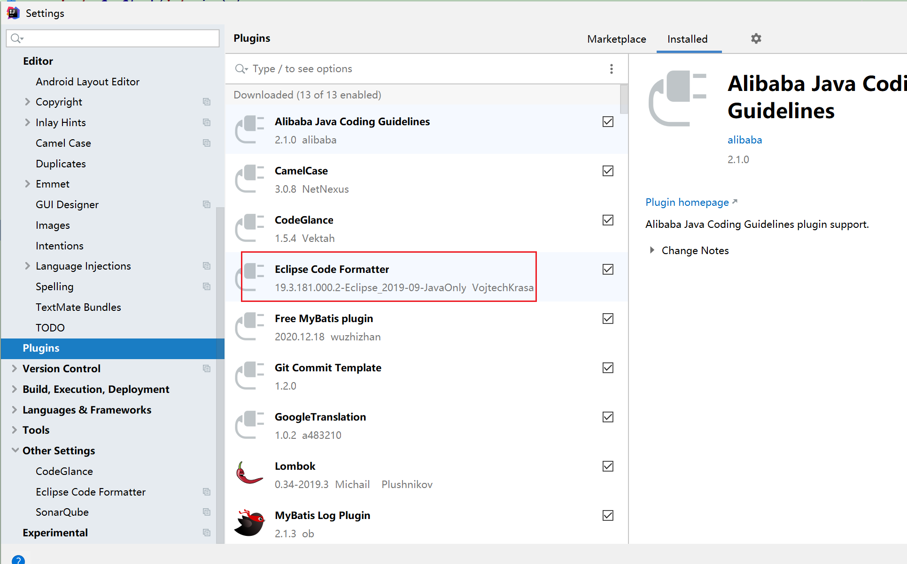

### 设置忽略文件

> 背景：idea commit 时总会带有非理想文件，比如.iml .idea文件，target 文件夹

解决办法：在 idea 中做相关配置，配置 setting 路径：搜索 file type，选中 file type类型，再右侧页面中配置需要忽略的文件类型和文件夹

**示例：**

*.iml; -> 忽略所有iml类型的文件。

target	表示忽略文件夹名称为 target 的文件夹。 

### 设计阿里巴巴 p3c 格式化代码模板

1. 下载eclipse格式化代码插件

   

2. 下载完成之后，idea settings左侧菜单的 other setting中会出现对应的 eclipse code formatter插件，点击选项

3. 右侧更换为使用该插件，并引入格式化代码文件

   