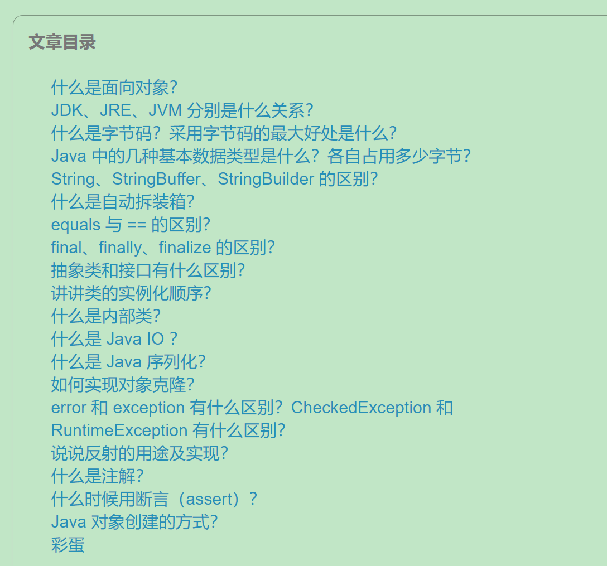

## 计算机基础

####  1、计算机网络

> 针对常见面试题，由点及线终及体
>
> 芋道源码 计算机网络面试题目积累：http://svip.iocoder.cn/Net/Interview/

####  2、数据结构和算法

> 掌握基本概念，实现原理，抽象对应的数据模型思想，配合题目输出经典的数据结构或者算法实战场景

##### 2.1、数据结构

1. **数组**
2. **链表**
3. **栈和队列**
4. **字符串**
5. 哈希表（散列表）
6. **树**
7. **堆**
8. 图

##### 2.2、算法

1. **八种排序算法**
2. **双指针**
3. **排序二分查找**
4. **深度有限搜索**
5. **广度有限搜索**
6. 拓扑排序
7. 并查集
8. **分治算法**
9. **回溯算法**
10. **贪心算法**
11. **动态规划**
12. 位运算
13. 数学

## Java 基础

> Tips：结合Effective Java学习，这里建议细分，将老芋奶的面试题目细分到各个知识模块
>
> **1、对象和接口**
>
> **2、集合**
>
> ​	Java自封装的数据结构，尤其是Hashmap需要重点掌握
>
> **3、异常**
>
> **4、多线程**
>
> **5、IO** 
>
> **6、java 网络编程**
>
> **7、注解**

### 1、Java 基础

### 2、Java 集合

> 总结常见问题，带着问题学习几个集合类
>
> 对几个集合类的继承实现关系做了解

### 3、Java 并发

> 参考一本书《Java 并发编程的艺术》
>
> 芋道的面试题目系列的顺序基本和书中保持一致，结合二者来看
>
> 另外，关于并发的题目真的特别多特别多

### 4、Java 虚拟机

> 参考极客时间课程 《深入拆解 Java 虚拟机》，芋道面试题目顺序基本和该课程目录一致，

## Java web

- JSON
- 拦截器、过滤器
- cookie session

## 数据存储

### 1、关系型存储，以 MySQL 为例

> 详见老芋奶 MySQL 面试题目，两种：基础的面试题目 + 分库分表

### 2、非关系型存储，以 MongoDB 为例

### 3、缓存

> 见老芋奶的 缓存 面试题目

### 4、Redis 为例

> 建立在前一部分 缓存 的基础上看这个，可详见老芋奶的面试题

## 框架

### 1、Spring

### 2、Spring MVC

### 3、Spring Boot

### 4、Mybatis

### 5、Spring Cloud

### 6、Netty

### 7、Dubbo

### 8、Quartz 框架

> 实战环节，可以此为基础聊线程间的通信问题

## 消息队列

> 基本的队列相关的面试题目 + 三种具体的队列实现

### 1、RocketMQ

### 2、RabbitMQ

### 3、Kafka

## 服务器

#### 1、基本命令

> 结合《Linux命令大全》系统学习，老芋奶有整理对应的命令行大全

#### 2、Docker

> 以目前进度来看，熟悉基本的操作手册即可。

#### 3、MinIO

> 分布式存储服务，但是现在用的还是比较浅的

#### 4、Tomcat

> 基本上已经很少用了，做简单了解

#### 5、Nginx

> 从正向代理、反向代理、配置负载分流搞起来
>
> 详见面试题目

## 设计模式

> 理解设计思想，稍微复杂的呈现在 UML 中，面试中可能会要求手画 UML 图示 
>
> 顶层设计上分为三中类型：创建型模式、结构性模式、行为型模式。